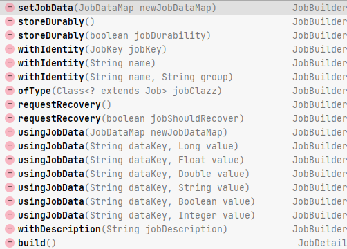
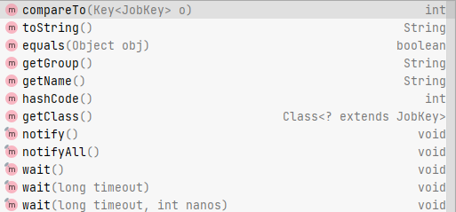
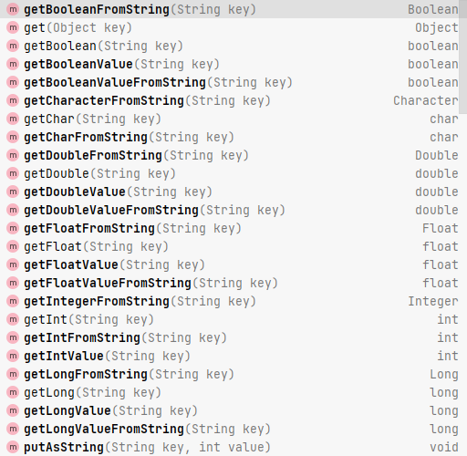
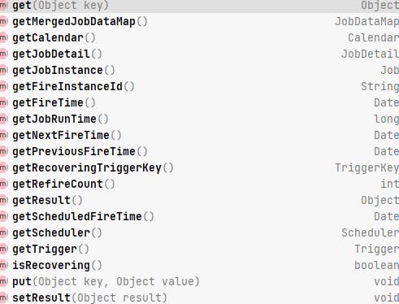
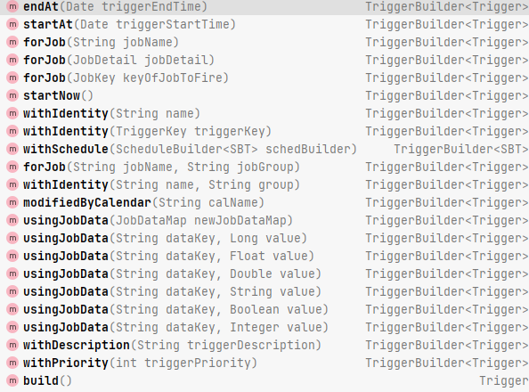

## 简介

https://docs.spring.io/spring-boot/docs/2.0.0.M3/reference/html/boot-features-quartz.html

官网：
<https://github.com/quartz-scheduler/quartz>

配置：
<http://www.quartz-scheduler.org/documentation/quartz-2.3.0/configuration/ConfigMain.html>

## 类库

### Scheduler 调度器

> This is the main interface of a Quartz Scheduler.
> 这是 Quartz 调度器的主接口。

> A Scheduler maintains a registry of JobDetails and Triggers. Once registered, the Scheduler is responsible for executing Jobs when their associated Triggers fire (when their scheduled time arrives).
> 
> Scheduler 维护 JobDetail 和 Trigger 的注册。注册后，Scheduler 负责在其关联的 Trigger 触发时（当其计划时间到达时）执行作业。

> Scheduler instances are produced by a SchedulerFactory. A scheduler that has already been created/initialized can be found and used through the same factory that produced it. After a Scheduler has been created, it is in "stand-by" mode, and must have its start() method called before it will fire any Jobs.
> 
> Scheduler 实例由 SchedulerFactory 生成。可以通过生产 Scheduler 的同一工厂找到和使用已经创建/初始化的 Scheduler。创建 Scheduler 后，它处于“待机”模式，在触发任何作业之前，必须调用其start()方法。

> Jobs are to be created by the 'client program', by defining a class that implements the Job interface. JobDetail objects are then created (also by the client) to define a individual instances of the Job. JobDetail instances can then be registered with the Scheduler via the scheduleJob(JobDetail, Trigger) or addJob(JobDetail, boolean) method.
> 
> Job 将由“客户端程序”创建，方法是定义实现 Job 接口。然后（也由客户端）创建 JobDetail 对象，以定义Job的单个实例。然后，可以通过 scheduleJob(JobDetail, Trigger) 或 addJob（JobDetail, boolean）方法向 Scheduler 注册 JobDetail 实例。

> Triggers can then be defined to fire individual Job instances based on given schedules. SimpleTriggers are most useful for one-time firings, or firing at an exact moment in time, with N repeats with a given delay between them. CronTriggers allow scheduling based on time of day, day of week, day of month, and month of year.
> 
> 然后，可以定义 Trigger，以根据给定的计划触发单个作业实例。SimpleTrigger 最有用的是一次性触发，或在确切的时间时刻触发，N个重复，它们之间有给定的延迟。CronTrigger 允许基于一天中的时间、周中的一天、月中的一天和年中的月份进行调度。

> Jobs and Triggers have a name and group associated with them, which should uniquely identify them within a single Scheduler. The 'group' feature may be useful for creating logical groupings or categorizations of Jobss and Triggerss. If you don't have need for assigning a group to a given Jobs of Triggers, then you can use the DEFAULT_GROUP constant defined on this interface.
> 
> 作业和触发器具有与它们关联的名称和组，这些名称和组应在单个调度程序中唯一标识它们。“组”功能可能有助于创建作业和触发器的逻辑分组或分类。如果您不需要将组分配给给定的触发器作业，则可以使用在此接口上定义的默认组常量。

> Stored Jobs can also be 'manually' triggered through the use of the triggerJob(String jobName, String jobGroup) function.
> 
> 存储的作业也可以通过使用 triggerJob(String jobName, String jobGroup) 函数“手动”触发。

> Client programs may also be interested in the 'listener' interfaces that are available from Quartz. The JobListener interface provides notifications of Job executions. The TriggerListener interface provides notifications of Trigger firings. The SchedulerListener interface provides notifications of Scheduler events and errors. Listeners can be associated with local schedulers through the ListenerManager interface.
> 
> 客户端程序也可能对Quartz提供的“侦听器”接口感兴趣。JobListener接口提供Job执行的通知。触发器监听器接口提供触发器触发的通知。SchedulerListener接口提供Scheduler事件和错误的通知。监听器可以通过监听器管理器接口与本地调度器关联。

### JobDetail 任务实例: 用于定义任务

- JobDetail 对象由 Quartz 客户端在将 Job 加入 Scheduler 时提供
- Job 定义任务内容（做什么），JobDetail 在 Job 的基础上增加了 JobDataMap/JobKey/Description 等属性，将 Job 进行了实例化
  - JobKey: Job的唯一性标识，由 name 和 group 组成，并且名称在组中必须是唯一的。如果仅指定了名称，则将使用默认组名称
  - JobDataMap: 储存各类型Map信息，它是在调度程序和Job之间传递数据的桥梁
  - Description: 字符串，描述 Job

### JobBuilder: Job构建器，生成 JobDetail

```Java
JobDetail jobDetail = JobBuilder.newJob()
        .ofType(MyJob.class)                             // Class 关联的Job类
        .setJobData(new JobDataMap())                       // DataMap 数据Map
        .withIdentity(new JobKey("MyJob"))               // [name, group] [名称，分组]，每个Job唯一
        .withDescription("MyJob")                        // Description 描述
        .storeDurably(false)                                // Durably 持久化，指示Job在孤立后是否应继续存储（没有触发器指向它时）
        .build();
```



#### JobKey

```Java
JobKey jobKey = jobDetail.getKey();
```



#### JobDataMap

```Java
JobDataMap jobDataMap = jobDetail.getJobDataMap();
```



### Job: 任务

```Java
public class MyJob implements Job {
    @Autowired
    private SampleJobService jobService;

    @Override
    public void execute(JobExecutionContext context) throws JobExecutionException {
        JobDataMap jobDataMap = context.getMergedJobDataMap();
        // Do your Job.
        jobService.executeSampleJob();
    }
}
```

#### JobExecutionContext: Job执行的上下文，可以获取 JobDetail 等



---

### Trigger 触发器: 用于定义触发时机

- 使用 TriggerBuilder 实例化 Trigger
- Trigger 具有与它们关联的 TriggerKey ，该 TriggerKey  应在单个调度程序中唯一标识它们
- Trigger 是调度作业的“机制”。许多 Trigger 可以指向同一 Job，但单个 Trigger 只能指向1个 Job
- Trigger 可以通过将 contents 放入 Trigger 上的 JobDataMap 中，“发送” parameters/data 到 Job（注意，JobDataMap可以同时在 JobDetail 和 Trigger 中定义，以 Trigger 中定义的优先）

```JAVA
Trigger trigger = TriggerBuilder
        .newTrigger()
        .forJob(jobDetail)                                                                                  // 绑定 Job 实例
        .withIdentity(new TriggerKey("name", "group"))                                                      // [name, group] [名称，分组]，每个Job唯一
        .withSchedule(SimpleScheduleBuilder.simpleSchedule().withIntervalInSeconds(5).repeatForever())      // 调度规则
        .withPriority(5)                                                                                    // 触发的优先级，Trigger间生效
        .startNow()                                                                                         // 立即执行一次任务
        //.startAt(new Date(2022, 1, 1))                                                                    // 开始时间
        .endAt(new Date(2022, 2, 1))                                                                        // 结束时间
        .build();
```



### ScheduleBuilder

#### SimpleScheduleBuilder

#### CronScheduleBuilder

## 配置

```YAML
spring:
  # Quartz 的配置，对应 QuartzProperties 配置类
  quartz:
    job-store-type: memory # Job 存储器类型。默认为 memory 表示内存，可选 jdbc 使用数据库。
    auto-startup: true # Quartz 是否自动启动
    startup-delay: 0 # 延迟 N 秒启动
    wait-for-jobs-to-complete-on-shutdown: true # 应用关闭时，是否等待定时任务执行完成。默认为 false
    overwrite-existing-jobs: false # 是否覆盖已有 Job 的配置
    properties: # 添加 Quartz Scheduler 附加属性
      org:
        quartz:
          threadPool:
            threadCount: 25 # 线程池大小。默认为 10
            threadPriority: 5 # 线程优先级
            class: org.quartz.simpl.SimpleThreadPool # 线程池类型
```

## References

<https://www.cnblogs.com/summerday152/p/14192845.html>
<https://www.cnblogs.com/summerday152/p/14193968.html>
<https://www.baeldung.com/spring-quartz-schedule>
